# Mikroservisler Kavram Haritası (Concept Map)

Mikroservis mimarisindeki tüm ana başlıkların, teknolojilerin ve tasarım desenlerinin birbirleriyle olan ilişkisini gösteren kavram haritası.

```mermaid
graph TB
    MS[Mikroservis Mimarisi] --> COM[İletişim - Communication]
    MS --> DATA[Veri Yönetimi - Data Management]
    MS --> INF[Altyapı & Dağıtım - Infrastructure]
    MS --> RES[Dayanıklılık - Resilience]
    MS --> OBS[Gözlemlenebilirlik - Observability]
    MS --> SEC[Güvenlik - Security]

    %% İletişim
    COM --> SYNC[Senkron]
    COM --> ASYNC[Asenkron]
    SYNC --> REST[REST API / HTTP]
    SYNC --> GRPC[gRPC / HTTP2 / Protobuf]
    ASYNC --> EV[Event-Driven / Pub-Sub]
    ASYNC --> MB[Message Broker]
    MB --> RMQ[RabbitMQ]
    MB --> KFK[Apache Kafka]

    %% Veri Yönetimi
    DATA --> DPS[Database per Service]
    DATA --> SAGA[Saga Pattern]
    SAGA --> CHOR[Choreography]
    SAGA --> ORCH[Orchestration]
    DATA --> CQRS[CQRS Pattern]
    DATA --> ES[Event Sourcing]

    %% Altyapı
    INF --> AGW[API Gateway]
    INF --> SD[Service Discovery / Registry]
    INF --> CONT[Konteynerizasyon]
    CONT --> DOCK[Docker / Compose]
    CONT --> K8S[Kubernetes]

    %% Dayanıklılık
    RES --> CB[Circuit Breaker]
    RES --> RET[Retry & Backoff]
    RES --> RL[Rate Limiting]
    RES --> BH[Bulkhead]

    %% Gözlemlenebilirlik
    OBS --> LOG[Merkezi Loglama]
    LOG --> ELK[ELK / Loki]
    OBS --> TRC[Distributed Tracing]
    TRC --> OTel[OpenTelemetry / Jaeger]
    OBS --> MET[Metrikler]
    MET --> PROM[Prometheus / Grafana]

    %% Güvenlik
    SEC --> OAUTH[OAuth2 / OIDC]
    SEC --> JWT[JSON Web Token]
    SEC --> MTLS[mTLS - Mutual TLS]
```

---

## Kavramların Hızlı Özeti (Quick Reference)

### 1. İletişim (Communication)
*   **Senkron (REST/gRPC):** İstek-cevap döngüsü anlıktır. gRPC, servisler arası yüksek performanslı iç haberleşme için kullanılır.
*   **Asenkron (RabbitMQ/Kafka):** Servisler gevşek bağlıdır (loosely coupled). Biri çöktüğünde diğeri işine devam edebilir, mesajlar kuyrukta biririk.

### 2. Veri Yönetimi (Data)
*   **Database per Service:** Her servisin veritabanı kendine özeldir. Servis sınırlarını (Bounded Context) korur.
*   **Saga Pattern:** Dağıtık işlemlerde ACID yerine BASE (Eventually Consistent) mantığıyla çalışır. Başarısızlık anında geri alma (compensating) işlemleri yapar.
*   **CQRS:** Veri yazma ve okuma yollarını ayırarak okuma hızını maksimize eder.

### 3. Dayanıklılık (Resilience)
*   **Circuit Breaker:** Aşırı hata veren bir servise giden trafiği keserek sistemin tamamen çökmesini engeller.

### 4. Altyapı (Infrastructure)
*   **API Gateway:** Giriş kapısı. Güvenlik, yönlendirme, rate limiting burada yapılır.
*   **Service Discovery:** Servislerin ağdaki yerlerini (IP/Port) otomatik kaydettiği ve bulduğu sistem.

### 5. Gözlemlenebilirlik (Observability)
*   **Distributed Tracing:** İsteklerin tüm servislerdeki yolculuğunu (Trace ID ile) izleme.
*   **Centralized Logging:** Tüm servis loglarını tek bir yerde toplama.
